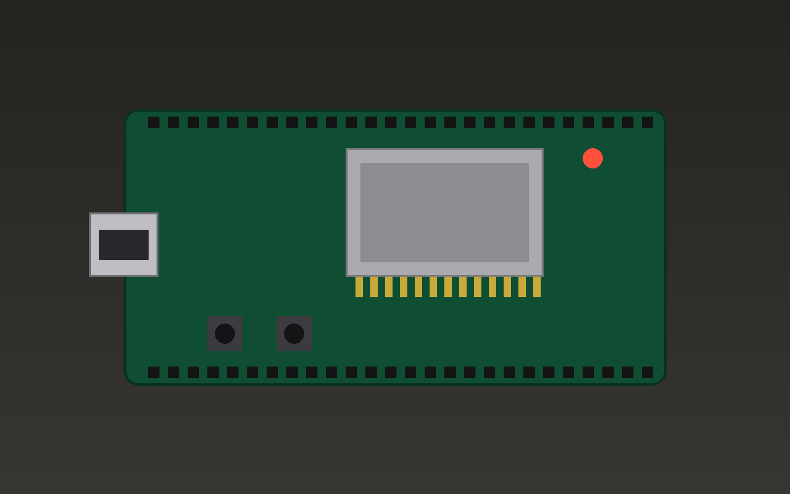

@slide cycle layout=diagram keypoints=cycle title=top-right

@diagram boxes
grid 4x4
box repo   "Stap 1 - Repo"      at 0,0          step=1
box idea   "Stap 2 - Idee"      at 1.5,0        step=2
box fsd    "Stap 3 - FSD"       at 2.4,1        step=3
box impl   "Stap 4 - Bouwen"    at 2.6,2        step=4
box code   "Stap 5 - Code"      at 2.4,3        step=5
box flash  "Stap 6 - Flashen"   at 0.9,3        step=6
box test   "Stap 7 - Testen"    at 0.1,2        step=7
box enh    "Stap 8 - Verbeteren" at 0.35,1      step=8
arrow repo -> idea   step=2
arrow idea -> fsd    step=3
arrow fsd -> impl    step=4
arrow impl -> code   step=5
arrow code -> flash  step=6
arrow flash -> test  step=7
arrow test -> enh    step=8
arrow enh -> fsd     step=8

@nl
## Ishikawa-cirkel

@script
Zo ziet de werkwijze eruit.
@step
We beginnen met een repository.
@step
Dan het idee.
@step
Dat werken we uit in een functioneel ontwerp.
@step
Daarna de implementatie.
@step
De code zelf.
@step
Flashen naar het bord.
@step
Testen.
@step
En met wat we leren verbeteren we het ontwerp — en de cirkel begint opnieuw.

@en src=8a36e008
## Ishikawa Circle

@labels repo="Step 1 - Repo" idea="Step 2 - Idea" fsd="Step 3 - FSD" impl="Step 4 - Implement" code="Step 5 - Code" flash="Step 6 - Flash" test="Step 7 - Testing" enh="Step 8 - Enhance"

@script
This is what the workflow looks like.
@step
We start with a repository.
@step
Then the idea.
@step
We work that out in a functional design.
@step
Then the implementation.
@step
The code itself.
@step
Flashing it to the board.
@step
Testing.
@step
And what we learn enhances the design — and the circle starts again.


@slide board layout=callouts keypoints=hardware

@image assets/devboard.png
@callout circle at 15.5%,49.5% r=6% label="USB-poort" label.en="USB port" step=1
@callout arrow from 22%,88% to 30%,68% label="Reset-knop" label.en="Reset button" step=2
@callout box at 43%,29% size=26%,28% label="ESP32-module" label.en="ESP32 module" step=3

@nl
## Het bord

@script
Even kort de belangrijkste onderdelen van het bord.
@step
Links zit de USB-poort: hier gaat de voeding en de seriële verbinding doorheen.
@step
Dit is de reset-knop.
@step
En dit is het hart van het bord: de ESP32-module.

@en src=e50ec65c
## The board

@script
A quick look at the main parts of the board.
@step
On the left is the USB port: power and the serial connection go through here.
@step
This is the reset button.
@step
And this is the heart of the board: the ESP32 module.


@slide flow layout=diagram

@diagram mermaid
flowchart LR
  A[Code] --> B[Build]
  B --> C[Flash]
  C --> D{Test OK?}
  D -- ja --> E[Klaar]
  D -- nee --> A

@nl
## De test-loop

@script
Dezelfde loop, maar nu als stroomschema.

@en src=08ec254b
## The test loop

@script
The same loop, but now as a flowchart.


@slide code-voorbeeld layout=code

@nl
## Een test in Python

```python steps=1-2|4-6|8
import serial
port = serial.Serial("/dev/ttyUSB0", 115200)

def wacht_op(tekst, timeout=10):
    regel = port.read_until(tekst.encode(), timeout)
    return tekst in regel.decode()

assert wacht_op("BOOT OK")
```

@script
Zo ziet een eenvoudige test eruit.
@step
Eerst openen we de seriële poort.
@step
Dan een hulpfunctie die wacht op een bepaalde tekst.
@step
En de test zelf: we verwachten dat het bord "BOOT OK" meldt.

@en src=d4abab17
## A test in Python

```python steps=1-2|4-6|8
import serial
port = serial.Serial("/dev/ttyUSB0", 115200)

def wait_for(text, timeout=10):
    line = port.read_until(text.encode(), timeout)
    return text in line.decode()

assert wait_for("BOOT OK")
```

@script
This is what a simple test looks like.
@step
First we open the serial port.
@step
Then a helper function that waits for a given text.
@step
And the test itself: we expect the board to report "BOOT OK".


@slide formule layout=formula

@nl
## Baudrate en tijd

$$t_{byte} = \frac{10}{\text{baudrate}}$$

Bij 115200 baud duurt één byte ongeveer $87\,\mu s$.

@script
Hoe lang duurt het versturen van één byte? Tien bits gedeeld door de baudrate.

@en src=8c8a4ee4
## Baud rate and time

$$t_{byte} = \frac{10}{\text{baud rate}}$$

At 115200 baud, one byte takes about $87\,\mu s$.

@script
How long does sending one byte take? Ten bits divided by the baud rate.


@slide vergelijking layout=table

@nl
## Handmatig of met agent?

| Taak | Handmatig | Met agent |
|---|---|---|
| Flashen | 1 min | automatisch |
| Log lezen | ogen op scherm | doorlopend |
| Testen | als je eraan denkt | elke build |

@script
Even naast elkaar gezet: wat verandert er als de agent het werk doet?

@en src=e8448640
## Manual or with an agent?

| Task | Manual | With agent |
|---|---|---|
| Flashing | 1 min | automatic |
| Reading logs | eyes on screen | continuous |
| Testing | when you remember | every build |

@script
Side by side: what changes when the agent does the work?


@slide twee-kolommen layout=two-col steps=auto

@nl
## Opstelling

- Laptop met agent
- USB-hub
- Testbord

@col


@script
De opstelling bestaat uit drie onderdelen.
@step
Een laptop waarop de agent draait.
@step
Een USB-hub.
@step
En het testbord zelf.

@en src=a3d455c9
## Setup

- Laptop with agent
- USB hub
- Test board

@col


@script
The setup consists of three parts.
@step
A laptop running the agent.
@step
A USB hub.
@step
And the test board itself.


@include @shared/slides/outro.md

